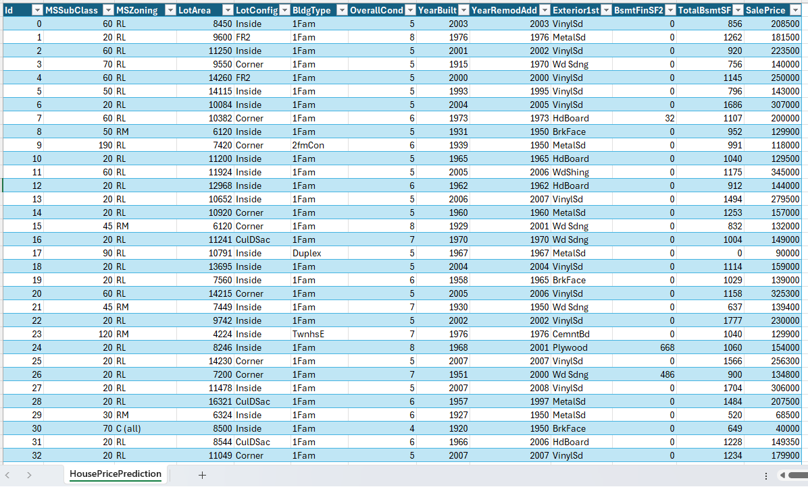

# House Price Data Preparation

## Overview  
This document outlines the data preparation steps performed on the Ames Housing dataset, which includes property characteristics and sale prices. The goal is to clean and standardize the data for predictive modeling or exploratory analysis.

---

## Data Examination  
The dataset contains the following columns:  
- **Id**: Unique identifier for each property.  
- **MSSubClass**: Building class code (e.g., 20 = 1-STORY 1946 & NEWER).  
- **MSZoning**: Zoning classification (e.g., RL = Residential Low Density).  
- **LotArea**: Lot size in square feet.  
- **LotConfig**: Lot configuration (e.g., Inside, Corner, Cul-de-sac).  
- **BldgType**: Type of dwelling (e.g., 1Fam = Single Family).  
- **OverallCond**: Overall condition rating (1-10).  
- **YearBuilt**: Original construction year.  
- **YearRemodAdd**: Remodel year (same as construction if no remodeling).  
- **Exterior1st**: Primary exterior material (e.g., VinylSd, MetalSd).  
- **BsmtFinSF2**: Type 2 finished basement area (square feet).  
- **TotalBsmtSF**: Total basement area (square feet).  
- **SalePrice**: Final sale price (USD).  

### Sample Data  
| Id | MSSubClass | MSZoning | LotArea | LotConfig | BldgType | OverallCond | YearBuilt | YearRemodAdd | Exterior1st | BsmtFinSF2 | TotalBsmtSF | SalePrice |  
|----|------------|----------|---------|-----------|----------|-------------|-----------|--------------|-------------|------------|-------------|-----------|  
| 0  | 60         | RL       | 8450    | Inside    | 1Fam     | 5           | 2003      | 2003         | VinylSd     | 0          | 856         | 208500    |  
| 1  | 20         | RL       | 9600    | FR2       | 1Fam     | 8           | 1976      | 1976         | MetalSd     | 0          | 1262        | 181500    |  

*(Truncated for brevity; full dataset contains 33 rows.)*  

---

## Data Transformation Steps  
1. **Data Cleaning**:  
   - Fixed typos in categorical values (e.g., "Vinylsd" → "VinylSd", "MetaIsd" → "MetalSd").  
   - Standardized missing values (e.g., `0` in `BsmtFinSF2` for no basement).  
   - Validated numerical ranges (e.g., `OverallCond` 1-10, `YearBuilt` > 1800).  

2. **Feature Engineering**:  
   - Added `AgeAtSale` = `YearRemodAdd` - `YearBuilt`.  
   - Created `HasBasement` binary flag (`TotalBsmtSF` > 0).  

3. **Outlier Handling**:  
   - Identified extreme `LotArea` or `SalePrice` values for review.  

4. **Export**:  
   - Saved cleaned data as `house_price_data_clean.csv`.  

---

## Sample Data Image
  

