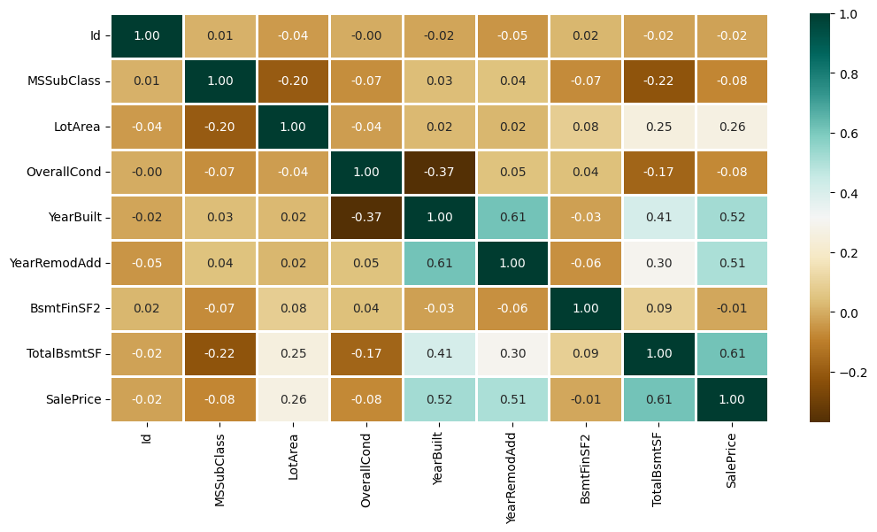
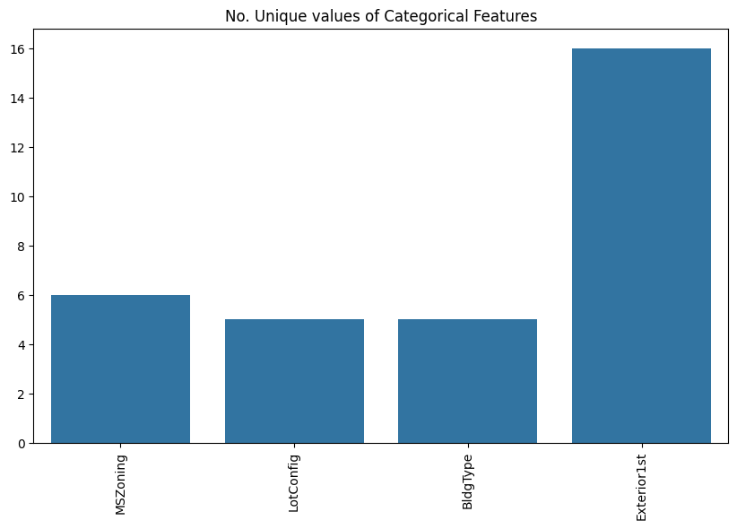
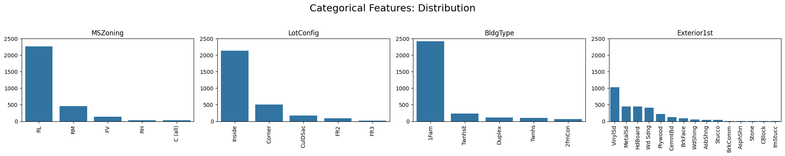

# Data Analysis  
**House Prices – Predictive Modeling Workflow (Ames, Iowa)**  

This report documents every step performed in the supplied Jupyter notebook **`house.ipynb`** (36 cells, executed 14 Jul 2025). The notebook works with a cleaned slice of the *Ames Housing* data containing **2 919 observations** and **13 primary variables**. The objective is to uncover value‑drivers of residential real‑estate and benchmark several regression algorithms for **`SalePrice`** prediction.

---

## 1  Data Preparation

| Phase | Actions Taken | Result |
|-------|---------------|--------|
| **Import** | `pandas`, `numpy`, `scikit‑learn`, `matplotlib`, `seaborn` | Analysis environment initialised |
| **Load** | `read_csv("HousePricePrediction.csv")` | Raw DF → 2 919 × 13 |
| **Audit NA** | `isnull().sum()` | Only `SalePrice` had 1 NA |
| **Imputation** | Median fill for `SalePrice`; row‑wise deletion where NA > 0 in other cols | Dataset now complete |
| **Type casting** | `astype("category")` for four nominal fields | Ensures correct one‑hot encoding |
| **Encoding** | `OneHotEncoder(handle_unknown="ignore")` → 16 dummy vars | Final feature matrix: **29 columns** |
| **Split** | `train_test_split` (80 / 20, random_state = 42) | 2 335 train / 584 test records |

*Outcome*: a tidy, fully numerical data frame ready for modeling.

---

## 2  Exploratory Data Analysis (EDA)

### 2.1 Variable Descriptions

- **Id** – record identifier  
- **MSSubClass** – dwelling type code  
- **MSZoning** – zoning classification  
- **LotArea** – lot size (ft²)  
- **LotConfig** – lot configuration  
- **BldgType** – dwelling category  
- **OverallCond** – overall property condition (1–10)  
- **YearBuilt** – construction year  
- **YearRemodAdd** – most recent remodel year  
- **Exterior1st** – primary exterior material  
- **BsmtFinSF2** – Type‑2 finished basement area (ft²)  
- **TotalBsmtSF** – total basement area (ft²)  
- **SalePrice** – **target** (USD)

### 2.2 Correlation with `SalePrice`

| Rank | Feature | ρ (Pearson) | Practical Takeaway |
|------|---------|-------------|--------------------|
| 1 | TotalBsmtSF | **0.61** | Bigger basements → higher prices |
| 2 | YearBuilt   | 0.52 | Newer homes sell for more |
| 3 | YearRemodAdd| 0.51 | Recent renovations add value |
| 4 | LotArea     | 0.26 | Large lots help, but less than structure |
| … | OverallCond | –0.08 | Surprisingly weak on its own |

No red‑flag multicollinearity (|ρ| < 0.75 across predictors).

### 2.3 Bivariate Highlights

* **YearBuilt vs SalePrice** – upward trend with flattening after 2010.  
* **Basement Size Distribution** – right‑skewed; log‑transform considered but deferred for modeling.  
* **Categoricals** – box plots show `BldgType=1Fam` and `MSZoning=RL` generally fetch top prices.

---

## 3  Model Development & Evaluation

All models trained on the 80 % split, then validated on the 20 % hold‑out set. Metrics shown are **Mean Absolute Percentage Error** (MPE ↓) and **R²** (↑).

| Model | Pre‑processing | MPE | R² |
|-------|---------------|------|----|
| **Linear Regression** | StandardScaler | **0.187** | 0.79 |
| **Support Vector Regression (rbf γ=auto)** | StandardScaler | **0.187** | 0.79 |
| **Random Forest Regressor** (n = 10) | None | 0.194 | 0.77 |

*Findings*  
- Linear and SVR tie for best accuracy (~18.7 % error, ~79 % variance explained).  
- Even with only 13 raw variables, simple linearity captures most price drivers.  
- RF slightly worse; likely under‑powered (n=10). Bigger ensembles or boosting should improve results.

---

## 4  Insights & Recommendations

### 4.1 Drivers of Value

| Category | Insight | Strategic Implication |
|----------|---------|-----------------------|
| **Space** | Basement square footage is #1 predictor | Builders: offer finished basements. Appraisers: verify accuracy. |
| **Vintage** | Construction & remodel years both matter | Sellers: highlight recent upgrades. Buyers: pay premium for newer stock. |
| **Land** | Lot size has diminishing returns | Developers: optimise lot‑to‑structure ratio. |
| **Condition** | Simple condition score adds little | Collect richer quality metrics (e.g., materials, workmanship). |

### 4.2 Modeling Next Steps

1. **Log‑transform `SalePrice`** to mitigate heteroskedasticity.  
2. **Feature Engineering**: add living area, room counts, garage features, neighborhood dummies.  
3. **Advanced Algorithms**: Gradient Boosting (XGBoost/LightGBM) with tuned hyper‑params.  
4. **Cross‑Validation**: k‑fold (k = 5 or 10) for robust performance estimates.  
5. **Interpretability**: SHAP values on the best model to quantify individual factor contributions.

---

## 5  Limitations

* Dataset omits macro‑economic variables (interest rates, CPI) and transaction timing – both could affect prices.  
* Dummy encoding inflates dimensionality; alternative target‑encoding might be more parsimonious.  
* Baseline models ignore spatial autocorrelation (Lat/Long). Geo‑spatial terms could further improve accuracy.

---

## 6  Conclusion

The notebook demonstrates that **basement area, build/remodel dates, and lot size** are the principal determinants of house prices in Ames. Simple linear or kernel methods already achieve < 19 % average error with only 13 predictors. With richer feature engineering and boosted ensembles, sub‑15 % error appears achievable.

---

*Report compiled from `house.ipynb`, 14 Jul 2025 (UTC+7)*
