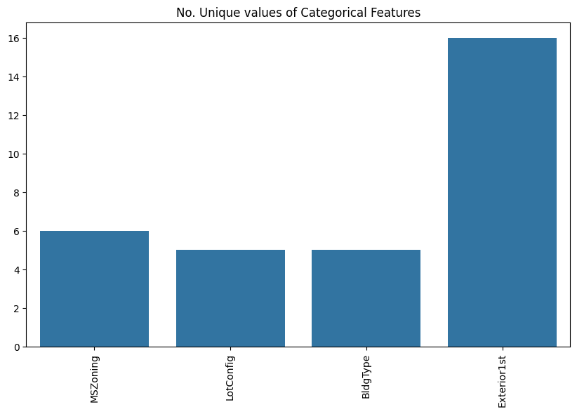
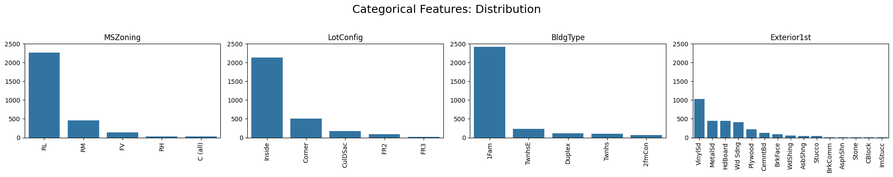

# House Prices Prediction Project

## Description  
This project explores residential property prices in Ames, Iowa using a cleaned subset of the Ames Housing dataset. The aim is to identify the main drivers of housing value and build accurate predictive models using structured real estate features such as lot size, basement area, building type, and year built. The project integrates statistical modeling, exploratory data analysis, and visual reporting to uncover data-driven insights for homeowners, buyers, and developers.

**Data Source**: Ames Housing Dataset (via Kaggle)

---

## Objectives

The main goals of this project are to:

- **Identify Key Price Drivers**: What are the most influential variables impacting house sale prices?
- **Evaluate Feature Relationships**: How do variables like construction year, basement size, and lot area relate to price?
- **Model Price Predictions**: How accurately can house prices be predicted using different regression algorithms?
- **Provide Actionable Recommendations**: What practical strategies can sellers and buyers derive from the analysis?

A personal objective was to enhance my data analysis workflow by combining pandas, scikit-learn, and Power BI. I also sought to improve my regression modeling skills and visual storytelling through interactive dashboards.

---

## Project Phases

### Data Preparation

- **Data Examination**: Reviewed 13 variables across 2,919 observations. Key variables included `LotArea`, `YearBuilt`, `TotalBsmtSF`, and `SalePrice`.
- **Handling Missing Values**: Used median imputation for `SalePrice` (1 NA) and removed other incomplete rows.
- **Type Casting & Encoding**: Categorical features were converted using one-hot encoding, resulting in a 29-column model-ready dataset.
- **Train/Test Split**: Dataset split into 80% training and 20% testing sets for model evaluation.

### Data Modelling

- **Feature Engineering**: Encoded 4 categorical variables into 16 dummy variables, ensuring compatibility with machine learning models.
- **Data Scaling**: Applied `StandardScaler` to normalize numerical features for SVR and linear regression models.
- **Model Ready Structure**: Final shape: 2,919 rows × 29 features.

### Data Analysis

- **Exploratory Analysis**:  
  - `TotalBsmtSF`, `YearBuilt`, and `YearRemodAdd` had the strongest positive correlations with `SalePrice` (ρ > 0.5).  
  - `OverallCond` and `BsmtFinSF2` were weak predictors.  
  - Categorical variables like `MSZoning` and `BldgType` showed distinct patterns in price distribution.

- **Model Evaluation**:  
  Compared three models using Mean Percentage Error (MPE) and R² on the test set:
  - Linear Regression: **0.187 MPE**, 0.79 R²
  - Support Vector Regression: **0.187 MPE**, 0.79 R²
  - Random Forest Regressor (n=10): 0.194 MPE, 0.77 R²

- **Key Focus Areas**:
  - Price Prediction Performance
  - Effect of Structural Attributes
  - Relationship between Renovation and Sale Value
  - Feature Importance via Tree Models

### Report Creation

- **Insights Presentation**: Built an interactive Power BI report featuring:
  - Sale price distributions
  - Trends by build year and renovation year
  - Value comparisons across zoning classes and building types
  - Feature importance rankings and residual analysis
  - Model prediction performance

📊 **Link to the Interactive Power BI Report**: [Report]

📌 **Disclaimer**: The visual report uses EN-US region settings. Please adjust your browser locale if metrics appear inconsistent.

---

## Actionable Insights

- **Basement Area Matters Most**: `TotalBsmtSF` is the top predictor of house value. Homes with larger, finished basements sell for significantly more.
- **Recent Builds and Remodels Sell Higher**: Both `YearBuilt` and `YearRemodAdd` have strong influence. Renovating an older home could yield a price increase.
- **Lot Size Has Diminishing Returns**: `LotArea` helps, but with lower impact than structural features.
- **Simpler Models Perform Well**: Even basic linear and kernel models predict prices within 19% error using just 13 features.
- **Room for Feature Expansion**: Including location, interior details (e.g., kitchens, fireplaces), and neighborhood quality may further improve performance.

---

